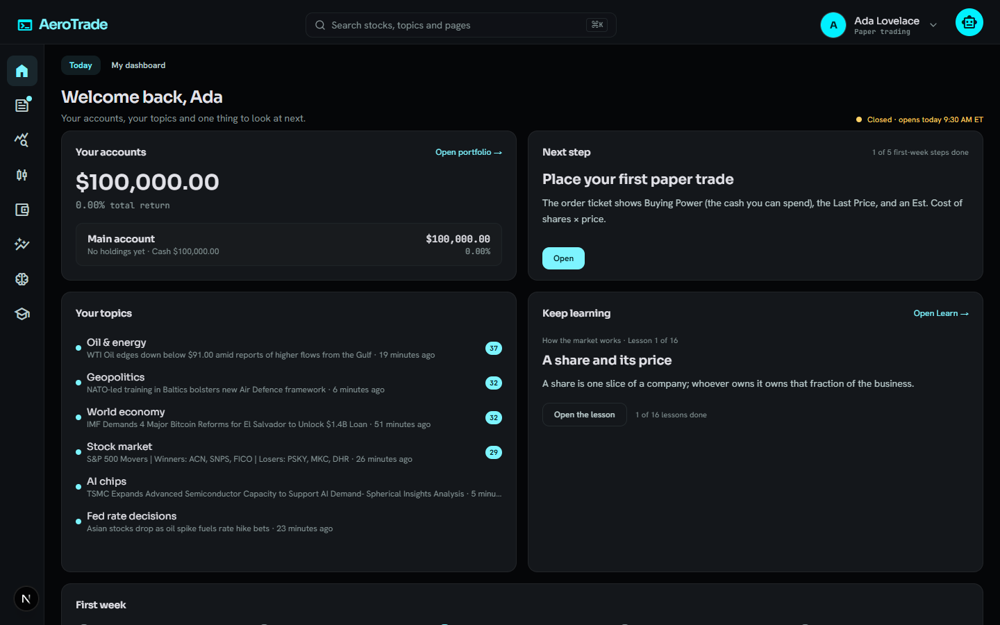
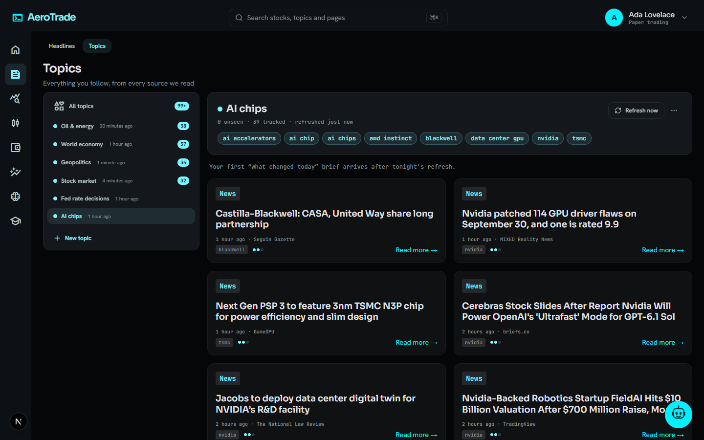
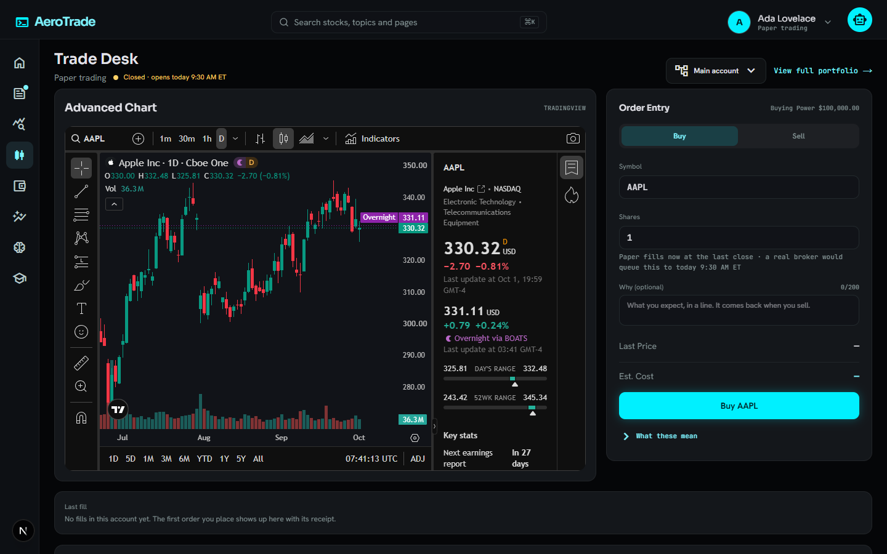
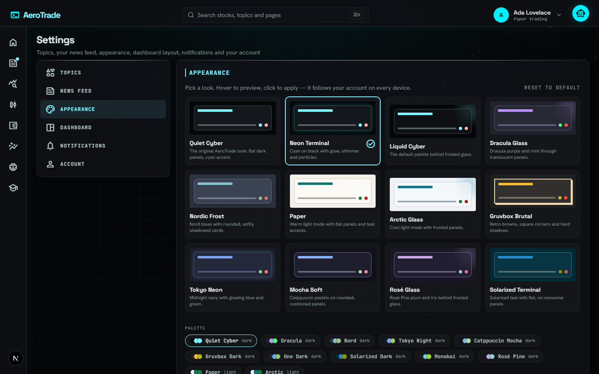
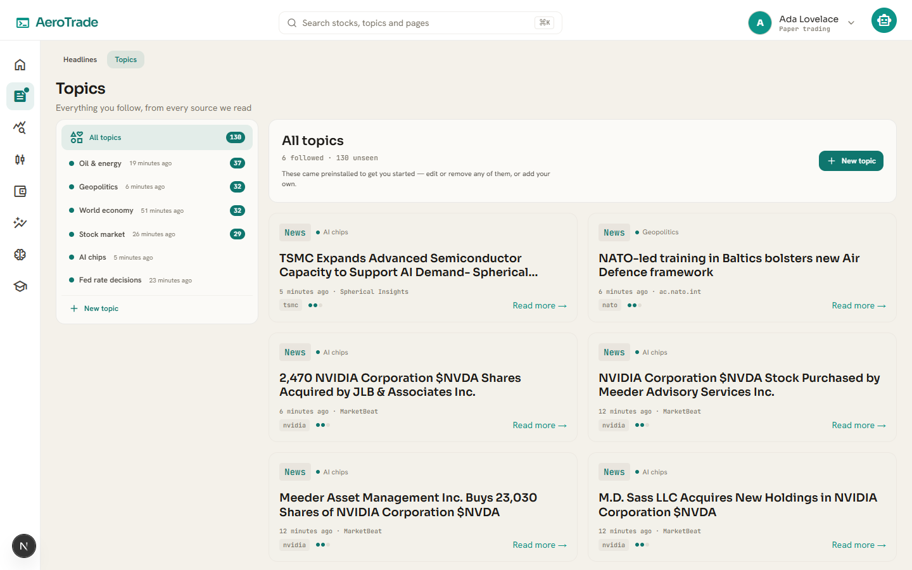
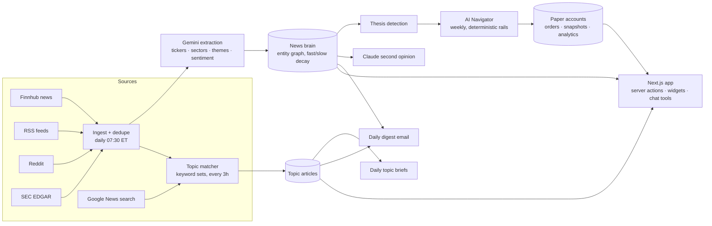

<div align="center">

# AeroTrade

**A paper-trading terminal with an AI news brain.**
Follow the topics you care about, test trading strategies with virtual money, and let scheduled AI jobs read hundreds of articles a day so you don't have to.

[](https://github.com/KingXaney/AeroTrade/actions/workflows/ci.yml)
[](LICENSE)




</div>

## What it does

**A front door and a home.** A visitor sees what AeroTrade is before making an account — its hero is a 3D terrain of SPY's momentum over the last year, one row per lookback from a week to a year, drawn from Tiingo's end-of-day prices (or, without a key, the app's own stored closes) and refreshed once an hour, that turns, flattens and answers a hover with the session under it; after sign-in, Home opens on the same terrain, then shows your accounts under one total, what changed in your topics, the morning's briefing, the next lesson and one thing to look at next. Navigation is eight icons on a slim rail, with a section's other pages as tabs above the page.

**A morning briefing.** Once a day a scheduled job condenses the most important articles the news brain read into a few points, each linked to the articles it draws on, and the news page sets it above your topics, the stories that name what you hold or watch, and a handful of top headlines.

**A beginner course.** Sixteen short lessons in four modules — how the market works, placing a trade, building a portfolio, reading the news — each quoting the app's own glossary, linking to the real screen and ending on one question.

**Follow the news, not just the tape.** Create a topic for anything — "Fed rate decisions", "AI chips", "NBA trade deadline" — and AeroTrade builds a feed for it from Google News search plus every source the news brain already reads. Each topic gets a daily AI *"what changed today"* brief, a slot in the daily email, and a place in the chat assistant. The topics page's **Edit topics** view adds starters in one click, removes a topic without a dialog (Undo from the toast) and shows how many of the 16 slots are in use.

**Paper-trade in accounts side by side.** Open several paper accounts with their own starting balance, place market orders at the last price, and compare them on return, drawdown, win rate and a daily benchmark curve against SPY. Export any account's fills — or a quant strategy's — as CSV.

**A news brain that builds market narratives.** Every morning a job ingests finance news, RSS, Reddit and SEC filings, has Gemini extract tickers, sectors and themes with sentiment, labels how each piece is written (reported, a company's own statement, an opinion piece, a rumour) so a take adds attention without steering sentiment, and folds them into an entity graph with *fast* (5-day) and *slow* (60-day) attention weights. Narratives whose slow weight stays high become **theses**. The /brain page draws that graph in 3D — themes, sectors and tickers on three shells, sized by attention and coloured by sentiment — with every node a link to its evidence.

**An AI Navigator that trades on those theses — inside hard rails.** Once a week it scores an eligible universe (news mass, sentiment, momentum, thesis, sector) and rebalances a dedicated paper account. Position count, weights, cash floor, trade frequency, holding period and stop-loss are deterministic constants; the LLM only writes the rationale.

**Eight classic quant strategies, paper-traded live and explained.** Buy & hold, 60/40, golden cross, dual momentum, 12-1 momentum, RSI-2 mean reversion, Donchian breakouts and low volatility each run in their own system account every trading morning, decided from the previous close and filled at the open through the same order path you use. A leaderboard ranks them by live return against SPY; each page explains the rule, shows what it is watching, its holdings and every fill with its reason, alongside a clearly labelled three-year simulated record. Deterministic rules, no AI.

**Learn from the numbers in front of you.** Every figure in the app carries its own definition — hover a column or open a panel's *"What these mean"* — from one glossary whose formulas are cited from the code that computes them, and `/learn` lists it all with a link to the real number on your account. A strategy page reads its signal board in plain words, and opens any fill to the exact board row the rule looked at that morning, its reason decoded clause by clause; its what-if lab moves one setting of the rule and redraws the three years beside the stored backtest, and the buy-and-hold page sets three ways of owning SPY — all at once, monthly, or kept as cash — side by side from a start date you pick. Your own account explains itself too: guess how much of your return came from interest and dividends, then see it split to the cent; every fill and every income line has a receipt, the "why" you wrote for a buy comes back when you sell, your trading habits (how long winners and losers were held, how many of each were sold) sit beside the strategies' cadences, and a histogram shows where your return landed among 1,000 random five-stock portfolios over the same days. `/brain` carries a legend of how articles become weights and theses, and every Navigator decision reads in plain words; a stock page says what each key number divides and what each strategy watching it sees. A First-week checklist ticks itself from what you actually did, a Today's lesson widget (and the daily email) picks up your first dividend or the term your topics used today, the order ticket says what an order does to the account before you place it (down to what the cash left would earn), and the chat tutor answers "what is my max drawdown?" from the same glossary, with your own figure, and decodes a quant strategy's or the Navigator's reason clause by clause. Descriptions only — a unit test keeps every sentence, chip and prompt free of advice.

**Play with the numbers.** Learn's Games page posts a quant puzzle every day — probability, expected value, counting, logic, estimation and strategy — answered against a server-side key, with hints one at a time and a worked solution. Solving the day's puzzle on its day keeps a Duolingo-style streak, shown on Home beside the market status; every past puzzle stays playable in the archive, and every answer key is checked by simulation or brute force in the unit tests. Beside it, a Zetamac-style arithmetic sprint (with custom ranges), an 80-questions-in-8-minutes interview mode, the Kelly coin game (a 60% coin beside the Kelly fraction on the same flips), a market-making game on four hidden dice against an informed trader, and Guess the correlation keep your records — the last three are replayed on the server from their seed and moves, so a score is never taken on trust.

**Solve a poker spot.** The poker solver, also under Learn, works everything out in your browser in a Web Worker. Equity between two hands or ranges — typed as `QQ+, AKs, 76s-T9s` or painted on the 13×13 grid — comes from an exact preflop table, an enumeration of every board, or seeded Monte Carlo with its standard error. Heads-up push or fold is solved to equilibrium by discounted CFR as the stack slider moves; the river solver takes two ranges, a board and a betting tree of your sizes and shows the equilibrium strategy of every hand at every decision; and pot odds give the break-even equity and the minimum defense. Nothing is stored, and AsAh against KsKh reproduces the textbook 1,410,336 wins and 9,308 ties over 1,712,304 boards.

**Poker night with friends.** Start a Texas hold'em table from the lobby under Learn, share its link or six-character code, and friends sit down from it — as guests with a name and a rolled avatar, no account needed. The server holds the deck and every rule (blinds and antes, side pots, the turn timer, pre-actions) and a tracker of every buy-in, rebuy and cash-out in play chips that have no cash value. A table goes live over Ably where a key is set and polls a no-store route everywhere else; the host picks the scene and the felt, each player their own card back and avatar, and anyone seated can send a reaction or throw a tomato. When the night ends, a summary shows every player's net and the night's awards.

**A second opinion, a chat advisor, and a digest.** Claude can critique the brain's current picture; a tool-using chat assistant (17 tools) — behind the robot in the bottom-right corner, which offers tips about the app on the topics pages — answers "what's new in my topics?", "what does max drawdown mean?" or "why did RSI-2 buy?"; a daily brief by email opens with the day in 30 seconds, then the stories about the reader's own stocks, the markets, their news feed, filings and what people are posting — each written from the articles it cites, with links to those articles and to the stock's page in the app — followed by the AI Navigator's week, their topics and the day's lesson.

**Make it yours.** 12 colour palettes × 5 visual styles (minimal, futuristic, liquid glass, brutalist, soft), saved per account and rendered without a flash. A 35-widget dashboard you can drag, resize and extend.

<div align="center">
 
<br>
 
</div>

## How it works



- **Ingestion is bounded, not greedy.** Per-source caps, a daily extraction budget (8 calls × 20 articles on Gemini's free tier), 1-second gaps between topic fetches, and a `NEWS_SEARCH_ENABLED` kill switch keep the whole thing free to run.
- **The brain never sees user topics.** Followed topics live in their own collection, keyed by keyword set so users who follow the same thing share one fetch. The navigator only ever scores the brain's global entities.
- **LLM output is treated as untrusted.** Extraction is JSON-parsed with zod and clamped; email HTML is sanitised with links allow-listed to the article set; briefs render as plain text; user keywords are escaped before they become a regex.
- **Every action is session-scoped.** Server actions derive the user from the session, validate ids, and scope every query by `userId`.

## Tech stack

| Layer | Choice |
|---|---|
| App | Next.js 16 (App Router, Server Actions, Turbopack), React 19, TypeScript strict |
| UI | Tailwind v4 with semantic theme tokens, shadcn/radix primitives, dnd-kit, TradingView embeds |
| Data | MongoDB + Mongoose 9 (29 models), better-auth for email/password sessions, sign-up, sign-in and password reset rate-limited on a Mongo counter |
| Jobs | Inngest (9 scheduled jobs + on-demand events), idempotent steps, per-user rate limits |
| AI | Vercel AI SDK; Gemini 2.5 Flash-Lite on the free tier for every scheduled job, optional Claude tiers, Claude for the second opinion |
| Realtime | Ably (optional, on its free tier): poker night's live tables, subscribe-only tokens per player; without a key every table polls |
| Market data | Yahoo Finance daily bars and dividends (Stooq as the fallback), the 13-week T-bill rate, Finnhub (quotes, profiles, financials, search, news), Google News RSS, SEC EDGAR, Reddit |
| Quality | Vitest (257 files / 3009 tests), ESLint, `tsc --noEmit`, a compile-only build, GitHub Actions; Playwright browser QA (19 suites, `npm run qa`) against an in-memory Mongo |

## Getting started

Prerequisites: Node 22 (`.nvmrc`), a MongoDB connection string (Atlas free tier works), a free [Finnhub](https://finnhub.io) key and a free [Gemini](https://aistudio.google.com) key.

```bash
git clone https://github.com/KingXaney/AeroTrade.git
cd AeroTrade
npm install
cp .env.example .env        # then fill in the values — every variable is documented there
npm run dev                  # http://localhost:3000
```

Background jobs run through Inngest. For local development start its dev server next to the app and fire any job by hand:

```bash
npx inngest-cli@latest dev -u http://localhost:3000/api/inngest
npm run trigger -- brain        # build the news brain now
npm run trigger -- topics       # refresh every followed topic (briefs: the AI briefs)
npm run trigger -- briefing     # write this morning's market briefing
npm run trigger -- navigator    # run the weekly AI Navigator
npm run trigger -- strategies   # run the quant strategies (-preview decides without filling)
npm run trigger -- income       # credit interest + dividends through yesterday
npm run trigger -- news         # send today's digest emails (news <email>: a test to one reader)
```

| Job | Schedule (ET) | What it does |
|---|---|---|
| `daily-brain-update` | 07:30 daily | ingest → extract → fold into the entity graph → detect theses |
| `refresh-topic-feeds` | every 3 h | fetch + match articles for every followed keyword set |
| `generate-market-briefing` | 07:50 daily | one briefing for everyone from the brain's most important articles of the day, each point citing its articles |
| `generate-topic-briefs` | 08:00 daily | one "what changed today" brief per topic with fresh news |
| `ai-navigator-weekly` | Mondays 10:00 | score the universe and rebalance the Navigator account |
| `daily-news-summary` | 12:00 daily | per-user daily brief, at most one per reader per day |
| `strategies-daily` | weekdays 09:35 (10:30 retry) | decide and fill every quant strategy's orders from the previous close; opens the system accounts and rebuilds backtests when a rule changes |
| `daily-account-snapshots` | weekdays 16:10 | value every account and the SPY benchmark |
| `daily-account-income` | 00:05 daily | credit every account's interest on idle cash (13-week T-bill rate) and dividends on holdings through yesterday; replays a never-credited account from inception |

## Development

```bash
npm run check         # lint + typecheck + unit tests (CI runs these, then build:check)
npm test              # vitest, a few seconds
npm run typecheck
npm run lint
npm run build:check   # compile-only build: proves the app builds without any keys
npm run qa            # browser QA: all 19 suites in scripts/qa against a throwaway harness (~5 min)
```

Unit tests (257 files / 3009 tests) cover every pure module, next to the code in `lib/<feature>/__tests__/`: fills, lots and account analytics, the interest and dividend accrual clock (with a parity test holding the strategy simulator to the live credit), the quant strategies' rules, engine, simulator and what-if grid, the AI Navigator's scoring and rails, the news brain's decay and extraction parsing, news aggregation and sanitising, the topic matcher and briefs, every learner-facing sentence (held to one no-advice word list) and the reason decoder's round trips, the chat tools' shaping, the email sections, dashboard layouts and theme tokens. Database-bound modules (Mongoose reads, server actions, the pages) are exercised through the browser QA in [`scripts/qa/`](scripts/qa/README.md) instead: `npm run qa` starts an in-memory MongoDB, the dev server with inline env vars and the Inngest dev server, then runs 18 Playwright suites, one per feature (`qa-auth`, `qa-home`, `qa-trading`, `qa-income`, `qa-strategies`, `qa-learn`, `qa-topics`, …), each signing up its own user and walking its surfaces — no keys needed. `docs/specs/` holds the design documents for the larger features.

## Project structure

Every feature has one folder name in every layer — `lib/trading/`, `components/trading/`, `lib/actions/trading.actions.ts`, `lib/learn/copy/trade.ts`, `scripts/qa/qa-trading.mjs`. [`docs/MAP.md`](docs/MAP.md) lists each feature's files in every layer and what to edit to change what.

```
app/            routes — (auth) sign-in, sign-up, forgot-password · (reset) reset-password
                (marketing) welcome — the landing page a signed-out visitor sees at /
                (root) home (/), dashboard, topics, topics/[slug], brain, strategies, strategies/[slug], stocks/[symbol],
                trade, portfolio, history, markets, news, watchlist, friends, friends/[id], learn,
                learn/course/[lesson], games, poker, poker-night, settings
                (play) play/[code] — a poker night table: full screen, no app shell, open to guests
                api/ chat, inngest, accounts/[accountId]/export, strategies/[slug]/export, landing/surface,
                poker-night/[code]/{state,detail,join,action,tick,token,emote}
components/     UI by feature (landing, auth, dashboard, trading, income, strategies, navigator, brain, news, topics, learn,
                chat, jobs, stocks, friends, settings, theme, games, poker, poker-night), plus primitives/ (the shared surface vocabulary),
                shell/ (top bar, icon rail, search), forms/ and ui/ (shadcn output)
lib/            one folder per feature, named as in components/:
  auth/         better-auth server, the one session read, sign-in / sign-up rate limits and validation
  dashboard/    widget catalog, layout normalisation + legacy migration, loaders
  trading/      paper accounts, orders and fills, the ledger, analytics, snapshots, CSV, /portfolio's learn panels
  income/       interest on idle cash + dividends: the accrual clock, the nightly credit, the Income panel
  strategies/   the quant strategies: catalog + rules, indicators, engine, simulator, what-if grid, job + page reads
  navigator/    universe eligibility, composite scoring, allocation rails, the weekly run
  brain/        extraction prompts + parsing, entity graph with dual-timescale decay, theses, second opinion, legend
  news/         source adapters (Finnhub, RSS, Reddit, SEC, Google News search), dedupe, sanitiser, the per-user feed
  topics/       keyword normalisation, matcher, search query builder, refresh, briefs, the starter set
  learn/        the glossary, the no-advice word list, every learner-facing sentence (copy/), the reason decoder,
                missions, today's lesson, the beginner course
  games/        the daily quant puzzle: its schedule, the answer reader, the streak
  poker/        the hand evaluator, ranges, exact and Monte Carlo equity, the preflop table, push/fold by CFR, pot odds, the river solver
  poker-night/  hold'em with friends: the pure engine and its clock, the room server (rooms, guests, the seat pass, the one
                compare-and-set write, its routes' checks), the lobby, the table's feed and realtime monitor, looks, emotes, awards
  chat/         the chat assistant: system prompt, tools and what they hand the model, rate limits and the caption that shows what is left of them
  email/        transport, the email frame, the daily brief (cited summary, view, render) with its topics + lesson sections, welcome and reset
  jobs/         the Inngest client, the job registry, one file of thin job wrappers per feature, the status read
  prices/       daily bars (Yahoo first, Stooq fallback), dividends + the T-bill rate, signals, NYSE hours, Finnhub
  stocks/       the watchlist, the stock page's key numbers and "what the rules see", TradingView embeds
  friends/ · settings/ · shell/ · theme/   friends and their leaderboard · preferences · nav sections + the rail cards · palettes + styles
  actions/      'use server' entry points (session-derived, userId-scoped), one file per feature
  ai/           model matrix by task and tier, inference, prompt helpers
  *.ts          shared: format, dates, text, rate-limit, day-memo, action-toast
database/       Mongoose models (one per file; its README maps model → feature) and the cached connection
hooks/          shared client hooks
public/         static images
scripts/        trigger.mjs (fire any job locally), qa/ (browser QA), the account migration, move.mjs (moves a
                file and rewrites every reference), the database check, the local second-opinion runner
docs/           MAP.md, specs/ (design docs), screenshots/
proxy.ts        signed-out redirect before render (the (root) layout re-checks the session)
```

## Origins

The auth screens, watchlist and email scaffolding began from a Next.js stock-tracker tutorial. Everything the product is about — the news brain, the AI Navigator, followed topics, paper-trading accounts, the chat tools, the theme engine and the widget dashboard — is original work, built and tested on top of that base.

## License

[MIT](LICENSE) © 2026 Xinnan Huang
